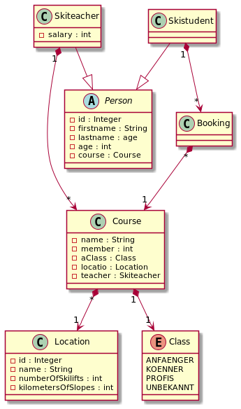

# primetzhofer-skischule project

## gh-pages

* https://2021-4ahitm-sew.github.io/02-assignment-cdi-Primetzvan

## Idee meines Microprojects
Eine Skischule kann mehrere Standorte haben, bei denen man sich in standortabhängige Kurse eintragen kann. 
Diese Kurse werden von Skilehrern gehalten.

## Klassendiagramm

## Anwendungsfalldiagramm

## Swagger Anzeige

### Neuer Kurs

### Kurs Ausgabe

### Kurs löschen

### Neuer Skischüler

### Skischüler Ausgabe

### Skischüler löschen

### Neuer Skilehrer

### Skilehrer Ausgabe

### Skilehrer löschen

### Neue Location

### Location Ausgabe

### Location löschen

